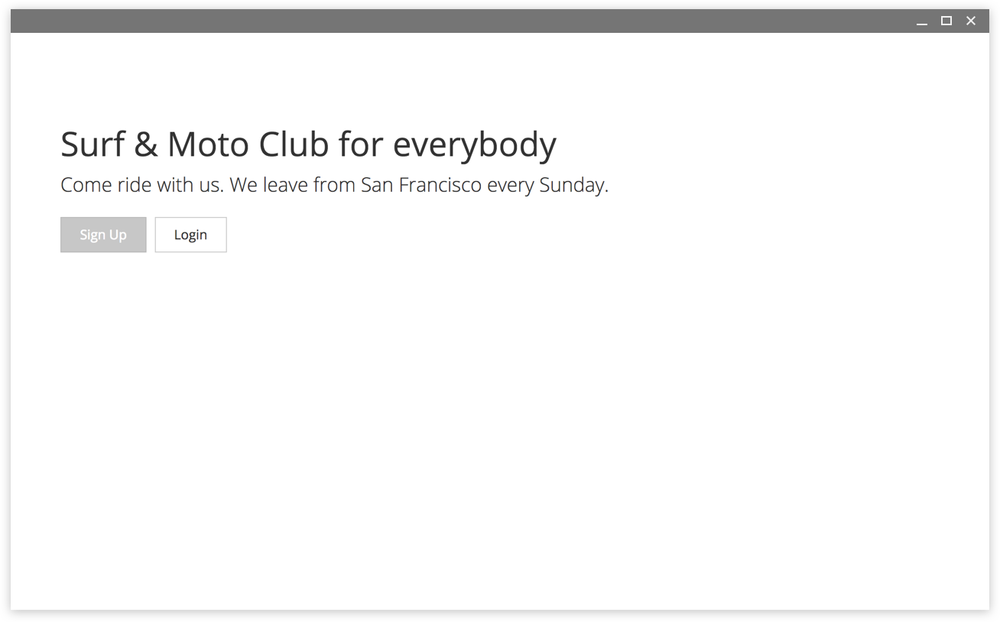
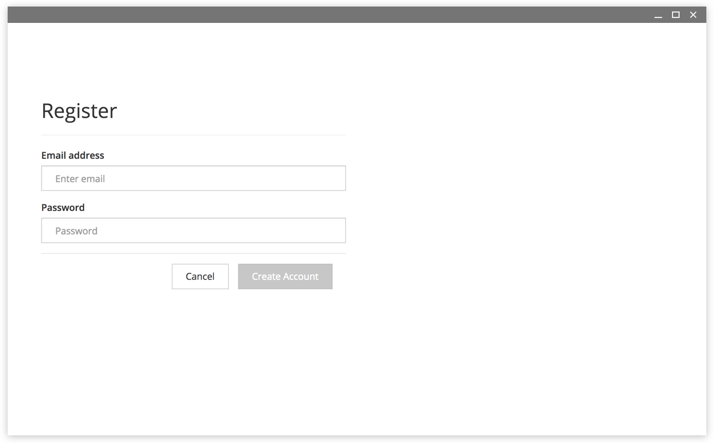
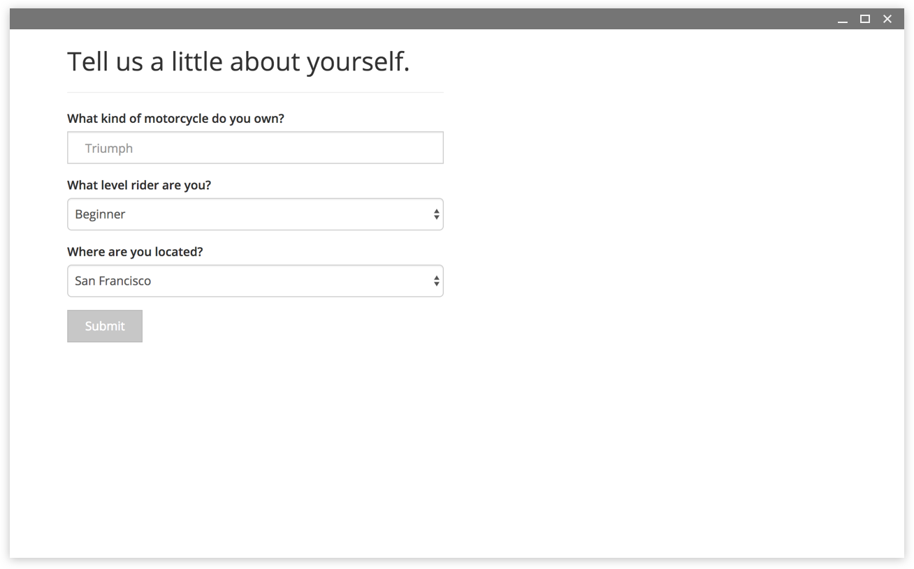
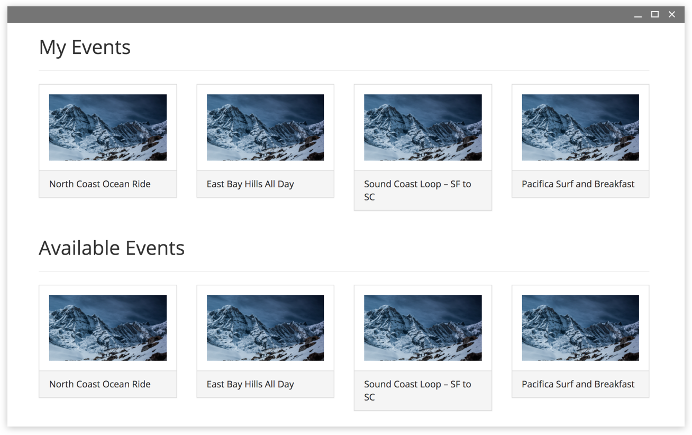

# Moto Event Manager

[](https://travis-ci.org/ryanbozarth/moto-event-manager)

https://moto-event-manager.herokuapp.com/

## Introduction
Moto Event Manager is an easy way to create create events for group motorcycle rides. Individuals can use an authenticated login to see the list of available rides, sign up for a ride, and know who will also be attending. This is still in development.

Get out and ride.









## Documentation

If you would like to try running it yourself:

```
$ npm mongod
$ npm start
```

## Packages and Other Technology Used

- Javascript
- Node
- MongoDB / Mongoose
- Passport
- Bcrypt
- Mocha / Chai
- Webpack
- Travis
